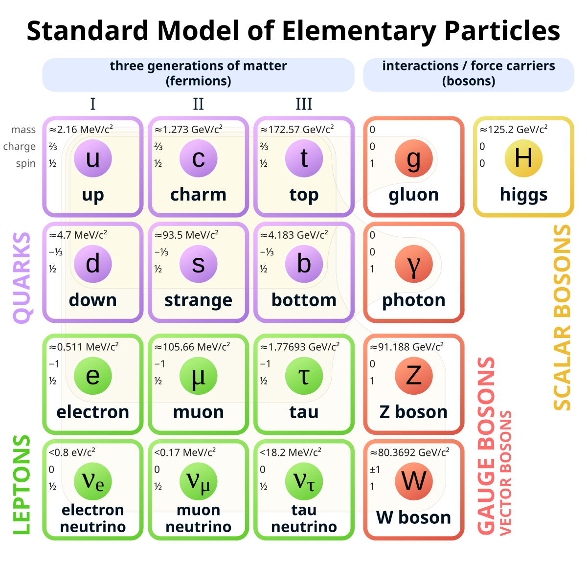

# quantum-works

Quantum Works is a study project to materialize the learnings about the [Standard Model](https://en.wikipedia.org/wiki/Standard_Model) by modeling this complex physics domain using object-oriented programming with C#.

The goal of this repository is (currently) educational-only and is a work in progress.

## Domain Modeling

The following picture depicts all 17 particles of the Standard Model. Quantum Works uses this as a starting point for its class modeling.

## Where to start?

Directly browse through the [QuantumWorks.Model](https://github.com/azborgonovo/quantum-works/tree/main/src/QuantumWorks.Model) library to check how interfaces, classes and constants are defined to represent the Standard Model. Or pay a visit to the [QuantumWorks.Model.Tests](https://github.com/azborgonovo/quantum-works/tree/main/test/QuantumWorks.Model.Tests) where we try out a few functions and properties in runtime.  

## Keep learning!

You can learn more about the Standard Model in many places. Here are some starting points:

- [CERN](https://home.cern/science/physics/standard-model)
- [Quantum Magazine](https://www.quantamagazine.org/a-new-map-of-the-standard-model-of-particle-physics-20201022/)

For further material about physics in video format I highly recommend:

- [World Science Festival](https://www.youtube.com/@WorldScienceFestival)
- [PBS Space Time](https://www.youtube.com/c/pbsspacetime)
- [StarTalk](https://www.youtube.com/@StarTalk)